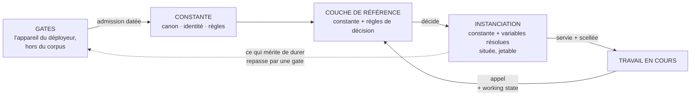
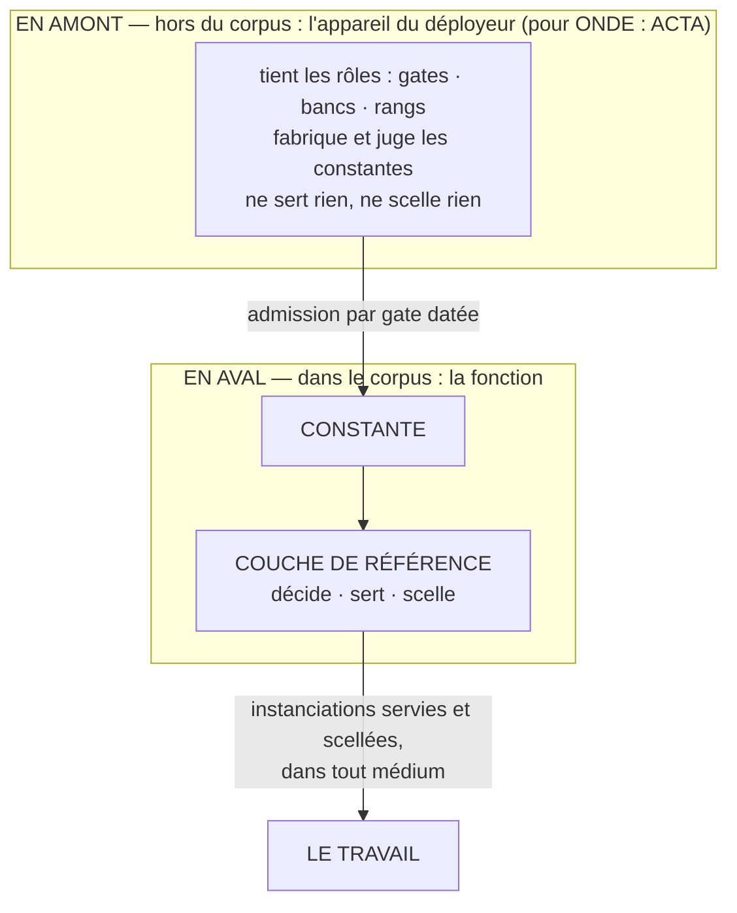

# WORKING REFERENCE

## La référence qui travaille : le corpus comme fonction

**JP Noto**

**Corpus 0.1.7 · 2026-08-11 · statut : proposé.**

---

### Abstract

Un corpus de référence s'emploie de deux façons : chargé en bloc, ou consulté à la demande. Les deux
échouent quand le travail dure. Chargé, son coût croît avec sa taille et dilue ce qu'il protège.
Consulté, ce qui arrive au travail dépend de qui se souvient, ou de ce qui ressemble, et personne ne
constate la divergence entre le travail et la référence.

Ce papier soutient qu'un corpus n'est pas un document qu'on lit mais une **fonction qu'on appelle** :
une **constante** (l'invariant gagné par gates) plus des **variables** (l'instanciation au contexte).
L'output est **décidé par la couche de référence d'après l'état du travail en cours**, **servi**
(jamais chargé en bloc) et **scellé** (la décision est traçable). Le média est une variable : un médium
de plus coûte un générateur et un banc, jamais une seconde couche de référence.

Deux conséquences. Une propriété mesurable : le volume servi par appel ne croît pas avec la taille du
corpus. Une lecture du test terminal du pipeline : ce qui doit survivre à un changement de génération
de modèle est la constante ; les variables sont faites pour changer.

Chaque revendication porte son rang de preuve. L'ensemble est une **hypothèse** (verdict du 2026-08-11,
§ 9) : les mécanismes existent séparément en usage réel ; leur réunion sous une seule fonction n'est
pas éprouvée. Le § 7 énonce ce qui la réfuterait.

---

## 1. Introduction

Les pathologies du contexte par accumulation (inflation, contradiction, indistinction) sont établies
ailleurs. LIVING REFERENCE en a fait son objet et règle le **statut** : ce qui fait autorité, par
validation datée et bornée. Acquis de la famille ; rien n'en est revendiqué ici.

Le statut ne dit pas comment l'autorité **travaille**. Un référentiel validé peut rester un document :
consulté quand on y pense, chargé quand on a peur d'oublier, absent de l'appel où il aurait changé la
décision. Entre la référence et le travail, un mécanisme manque : qui décide de ce qui monte au
contexte de *cet* appel, dans quel volume, sur quelle règle, avec quelle preuve.

Ce papier décrit ce mécanisme. Il est la lecture exécutable de LIVING REFERENCE : là où le glissement
sélectionne par statut ce qui entre au contexte d'une étape, la doctrine-fonction étend le geste au
corpus entier, à tout médium, et y ajoute la preuve. Le vocabulaire normatif vit dans la
[SPEC](SPEC.md), domicile unique des définitions ; ce papier explique, il ne redéfinit pas.

## 2. La fonction : constante, variables, instanciation

Tout corpus de référence contient deux choses que l'usage confond : ce qui ne doit pas bouger : canon,
identité, règles, et ce qui s'ajuste au travail du moment. La doctrine-fonction les sépare : la
**constante**, invariant gagné par gates ; les **variables**, résolues à chaque appel.

L'appel déclare son **working state** : la phase, l'unité en cours, le besoin. La **couche de
référence** décide l'**instanciation** : la constante plus les variables résolues pour ce travail-là.
La décision est réglée, jamais jugée : aucun auteur n'est requis à l'appel (SPEC, I2). Sinon la
fonction ne se code pas : on a renommé le travail. L'instanciation est située et jetable ; ce qui
mérite de durer repasse par une gate. Il n'y a pas d'autre porte.

Le test d'admission de la constante est prospectif et sévère : un élément lui appartient si sa révision
au changement de génération de modèle serait un échec du corpus ; le doute se tranche variable (SPEC,
C4). Ce test explique le critère terminal du pipeline du laboratoire : « survie à un changement de
génération sans révision » : ce qui doit survivre est la constante, elle seule. Quatre objets
construits séparément portaient cette lecture sans la nommer (§ 6) ; ce papier la nomme (**hypothèse,
non éprouvée comme généralisation**).

## 3. Servi et scellé

**Servi.** La référence se sert, elle ne se charge pas. Chaque élément de la couche déclare son contrat
de chargement : quel élément monte, à quel appel, sous quelle condition. L'appel reçoit exactement
l'instanciation décidée : rien de plus, rien de moins. Le principe est le plus ancien de la lignée : la
doctrine du template — l'information légère, au bon moment, dans le bon contexte, chaque fiche reliée à
sa source (**pratique constatée sur un an de projets, validée au conteneur : statut éditorial, pas un
rang du pipeline**).

D'où la propriété mesurable centrale : le volume servi par appel est borné par le besoin de l'appel,
jamais par la taille du corpus. À besoin constant, un corpus qui double ne sert pas plus de tokens
(**hypothèse ; l'indicateur (tokens servis par appel en fonction de la taille du corpus) est arrêté
avant toute mesure**).

**Scellé.** Chaque décision d'instanciation émet une trace certifiante : quel appel, quel état de la
constante, ce qui a été servi, la règle qui l'a décidé. Les scellés se chaînent : une piste, pas des
reçus épars. La primitive existe et tourne : la piste chaînée des dés certifiés de THE LOOP (**en usage
réel depuis le 2026-07-07, un praticien**). Le scellé d'instanciation est le même geste sur un autre
objet (**transposition non implémentée**). Le scellé constate, il n'autorise pas : une pièce d'audit,
jamais un verrou sur le travail.

## 4. Le média est une variable

La constante n'est jamais du texte, de l'image ou du son : c'est le canon, l'identité, les règles.
Texte, image et son n'en sont que des instanciations. Servir un nouveau médium ne demande donc pas un
nouveau système : un **générateur** (qui réalise l'instanciation dans ce médium), un **banc** (qui y
éprouve la conformité à la constante), la couche de référence restant unique. Le coût d'ajout se
mesure : ce qui doit être réécrit au premier médium ajouté. Premier franchissement au banc : un canon
de récit visuel transposé vers le récit interactif (**banc d'essai en cours, H(Q′) au registre ; unique
pièce du volet média, le papier n'en revendique pas davantage**).

## 5. Architecture : les rôles et l'appareil

La famille compte quatre couches, sans redondance : l'OS hôte gouverne le système, et trois corpus se
partagent le reste. [LIVING REFERENCE](https://github.com/JP-Noto/LIVING-REFERENCE) norme le statut du
savoir : ce qui fait autorité. [MYSTANCE](https://github.com/JP-Noto/MYSTANCE) norme la relation
humain–assistant. WORKING REFERENCE norme la référence qui travaille : comment l'autorité arrive à
l'appel.

Le test de conformité croisé est instructif. LIVING REFERENCE, passé contre la SPEC de ce corpus, est
une **instance partielle** : son glissement satisfait les familles constante, instanciation et service
— la sélection par règle est I1, sa propriété de coût constant est un cas de I4, mais il ne scelle
pas ses décisions de service : sa consignation trace les validations, jamais la construction du
contexte d'une étape. L'écart entre l'aîné et la SPEC du cadet est exactement l'apport revendiqué,
et la preuve que les couches ne se recouvrent pas.

Une frontière structure ce corpus, et l'auteur a trébuché dessus à la première relecture ; elle a donc
son paragraphe. Les **gates**, **bancs** et **rangs** de la SPEC sont des **rôles**, jamais des
institutions : l'appareil qui les tient est hors du corpus, et tout déploiement conforme le tient avec
son propre appareil, qu'il nomme. Pour ONDE, ces rôles sont tenus par
[ACTA](https://github.com/JP-Noto/ONDE/blob/main/methode/ACTA.md), l'appareil de méthode
du laboratoire : guichet, registre, verdicts, bancs. ACTA est en **amont** de la fonction : il fabrique et
juge les constantes ; il ne sert rien, ne scelle aucune instanciation, et n'est pas une instance
conforme de la SPEC. Un corpus qui généralise son propre juge tient cette frontière avec soin : les
rôles sont dans le corpus, le juge n'y est jamais. C'est ce qui rend l'ensemble portable : un tiers
déploie la fonction avec l'appareil de preuve qu'il a, pas avec le nôtre.

**Conditions d'application.** La fonction a un coût : déclarer la constante, écrire les contrats de
chargement, tenir les gates, sceller. Il ne se justifie que si le travail dure et que le corpus
dépasse ce qu'un appel peut porter. Le cas dégénéré est assumé : un corpus assez petit pour être
servi entier à chaque appel est le **cas zéro-variable** de la fonction : la constante servie en
bloc, le scellé trivial. Le montage simple qui marche n'est pas un rival : c'est le point de départ
de la courbe que la propriété I4 mesure, et la fonction prend son sens quand le corpus grossit plus
vite que le besoin des appels : là, précisément, où le chargement en bloc casse. Une hypothèse de
cadence est déclarée plutôt qu'ignorée : l'appareil de gates doit suivre la cadence des constantes
candidates, puisque tout ce qui mérite de durer repasse par une gate (SPEC, I3) ; au-delà de ce
débit, la gate devient goulot, et le régime de délégation ou d'échantillonnage est hors du périmètre
de cette version : même limite, déclarée dans les mêmes termes, que la cadence de validation de
LIVING REFERENCE.

## 6. Ce qui existe : les bancs vivants

L'hypothèse n'est pas née d'un plan. Quatre objets construits séparément dessinaient la même fonction ;
le dépôt qui fonde ce corpus l'a nommée. L'inventaire, chaque pièce à son rang :

- **THE LOOP, kernel gelé + modules just-in-time** : la constante gelée, les variables montées au
  besoin du tour (**en jeu réel depuis le 2026-08-07, un praticien, non mesuré**).
- **Le mode orchestré B-i** : l'orchestrateur décide le need-to-know de chaque appel : la décision
  d'instanciation mécanisée (**8/8 appels conformes le 2026-08-10 ; une séance, un praticien**).
- **SLIDING CANON** : référence maîtresse (constante), fenêtre (variables), déclencheur de révision —
  la décision d'output selon le travail en cours (**en usage réel, cas fondateur de LIVING
  REFERENCE**).
- **LA RÉGIE v0.1** : l'instanciateur : la couche qui sert le canon à la table (**déployée, non
  mesurée**).
- **La doctrine du template** : le contrat de chargement par section (**validée au conteneur, statut
  éditorial**).

Deux bornes. Toutes ces pièces sont l'œuvre d'un seul praticien opérant ses propres déploiements : un
point de donnée : l'auteur. Et THE LOOP est le **banc vivant** de la doctrine-fonction, pas sa
démonstration : le plafond posé ailleurs est maintenu : « démonstration » reste à prouver.

## 7. Ce qui réfuterait la méthode

La forme réfutable est domiciliée au registre des hypothèses d'ACTA (H(T)) ; la SPEC (§ 9) la décline
en cinq conditions de défaut. **La machine à dérive parfaite** : une instanciation diverge de la
constante sans qu'aucun banc ne le constate : pire que le document statique, qui ne prétend pas
servir ; branche à instrumenter en premier, réserve portée au verdict. **La fonction ne se code pas** :
un jugement d'auteur reste requis à chaque appel. **Le volume croît** avec la taille du corpus, à
besoin constant. **Une famille de systèmes** : chaque médium exige sa propre couche de référence.
**Le partage ne découpe rien** : au changement de génération, la constante se révise autant que les
variables.

Les deux premières conditions sont armées dès les bancs vivants. Les trois autres attendent leur
terrain : premier terrain instrumenté, premier médium ajouté, prochain changement de génération.
L'indicateur de chaque mesure est arrêté avant la première mesure, jamais après.

## 8. Travaux voisins

Le principe « une source unique, des instanciations par contexte » est un standard industriel établi,
et ce papier n'en revendique rien. **Design tokens** : la constante en tokens, instanciée par
plateforme : spécification du W3C Community Group (DTCG), première version stable octobre 2025. **Headless CMS** : le contenu constant servi
à tout canal ; le champ revendique « du site web à l'agent IA » : la portée média-agnostique est en
production depuis des années. **RAG et mémoire étagée** : l'instanciation par récupération selon le
contexte. **Policy-as-code** : la règle constante, l'évaluation située. Le voisin interne :
LIVING REFERENCE, dont le critère de sélection par la décision est l'acquis que ce corpus étend sans le
re-revendiquer.

L'apport revendicable, rétréci à la passe d'antériorité, tient en trois points. **(a)** La décision
d'instanciation pilotée par l'**état du travail en cours**, dans un système de production humain–IA
complet : là où les design tokens instancient par plateforme et le RAG par similarité. **(b)** Le
**scellé chaîné de la décision de service** — des voisins certifient leurs décisions (les *decision
logs* d'Open Policy Agent : input, version de la politique, résultat ; les *evaluation reasons* de
LaunchDarkly : la raison de chaque variation servie), mais sur des politiques et de la configuration,
sans piste chaînée constatée ni constante gagnée par gates : vérification adversariale versée :
[research/prior-art-2026-08-11.md](research/prior-art-2026-08-11.md). **(c)** La
**constante gagnée par gates** : une épistémologie en amont de la fonction, là où l'industrie versionne
sans épistémologie. Ces trois points sont ce que les bancs doivent éprouver ; s'ils tombent, il ne
reste de ce papier qu'une taxonomie de l'existant.

## 9. Conclusion

La portée de ce papier est celle de son rang. La doctrine-fonction est une **hypothèse** : verdict d'auteur
du 2026-08-11, dépôt ACTA #032, inscrite H(T) au registre (rév. 16), avec les réserves du verdict : la
source est mixte, pratique sur les pièces, anticipation sur leur réunion ; la portée média-agnostique
n'est éprouvée que sur un franchissement en cours ; la divergence d'instance sans détection est la
branche de mort à instrumenter en premier. Le prochain pas n'est pas d'épaissir ce texte : c'est le
banc de la dérive d'instance sur THE LOOP, seuils fixés avant mesure. Ses résultats, dans un sens ou
dans l'autre, feront la version suivante de ce papier.

---

*JP Noto · WORKING REFERENCE · [CC BY-NC-SA 4.0](LICENSE.md). Domicile canonique : <https://github.com/JP-Noto/WORKING-REFERENCE>.*
