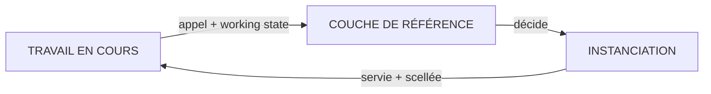

# INSTANTIATION : l'instanciation · l'output décidé selon le travail en cours

Fiche opérationnelle. **Domicile normatif : [SPEC § 4, règles I1–I4](../SPEC.md#4-instanciation--règles-i)** ;
ce document explique, illustre et borne, il ne redéfinit pas.

## Le problème, en trois phrases

Même avec une référence saine, quelqu'un doit décider ce qui monte au contexte de *cet* appel. Si c'est
l'auteur à chaque fois, le système ne passe pas l'échelle : la fonction ne se code pas, on a renommé le
travail. Si c'est la ressemblance qui décide, la décision a quitté la référence : ce qui monte est ce
qui ressemble, pas ce qui engage.

## L'idée, en une image

Une fonction, au sens plein : `output = f(constante, working state)`. Le travail déclare où il en est —
la phase, l'unité en cours, le besoin, et la couche de référence décide ce qui est servi, par des
règles écrites en amont.

L'instanciation est située et jetable : elle guide cet appel, puis meurt. Ce qui mérite de durer
repasse par une gate : il n'y a pas d'autre porte.

## Les questions que la pratique a posées, et les réponses

**« Qui écrit les règles de décision ? »** L'auteur : en amont, par gate, comme le reste de la
constante. Ce que I2 interdit, c'est son jugement *à l'appel*, pas son autorité sur les règles.

**« Une instanciation excellente, je la garde ? »** Elle repasse par une gate (I3). Une instanciation
qui s'installe sans gate est une référence de fait : exactement la dérive que le corpus existe pour
empêcher.

**« Et si le working state déclaré est faux ? »** La décision est réglée sur ce qui est déclaré : état
faux, service faux, et le scellé le montre, puisqu'il enregistre l'état déclaré. La fonction ne devine
pas ; elle rend l'erreur d'entrée auditable.

## Les règles (SPEC § 4)

- **I1.** La couche décide d'après le working state ; le contexte appelant ne choisit pas.
- **I2.** Décision réglée : aucun jugement d'auteur requis à l'appel.
- **I3.** Instanciation située et jetable ; durer = repasser par une gate.
- **I4.** Volume servi borné par le besoin, jamais par la taille du corpus.

## Les pièges

- **L'exception qui devient le régime** : chaque appel « particulier » qui rappelle l'auteur est I2 en
  train de tomber : comptez-les, c'est la condition de falsification n° 2 qui s'arme.
- **Le contexte qui se sert lui-même** : un appelant qui choisit ses morceaux a inversé I1 ; la
  référence est redevenue un buffet.
- **L'instanciation immortelle** : servie lundi, citée mardi, canonique vendredi, sans gate nulle
  part (I3).

## En pratique

Le cas vivant est le mode orchestré B-i de THE LOOP : l'orchestrateur décide le need-to-know de chaque
appel — 8/8 appels conformes le 2026-08-10, une séance, un praticien.

**Ce que ça change** : ce qui monte au contexte ne dépend plus de qui se souvient ni de ce qui
ressemble, mais d'une règle écrite, et le volume servi suit le besoin, pas la taille du corpus.

---

*JP Noto · WORKING REFERENCE · [CC BY-NC-SA 4.0](../LICENSE.md). Domicile canonique : <https://github.com/JP-Noto/WORKING-REFERENCE>.*
