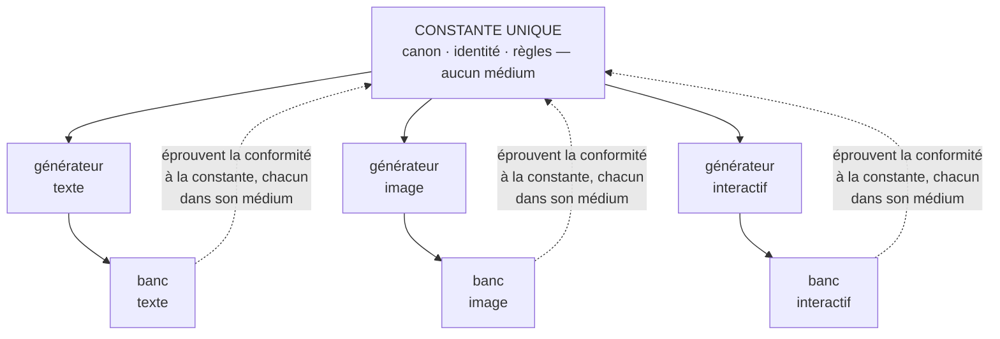

# MEDIUM : le médium · une variable, jamais une couche

Fiche opérationnelle. **Domicile normatif : [SPEC § 7, règles M1–M3](../SPEC.md#7-médium--règles-m)** ;
ce document explique, illustre et borne, il ne redéfinit pas.

## Le problème, en trois phrases

Chaque nouveau canal (image, audio, récit interactif) tend à faire naître son propre système de
référence, et les canons divergent entre médias faute d'une source commune. Le coût d'un médium devient
alors le coût d'un système entier. La cause est toujours la même : la « référence » avait été rédigée
dans un médium, au lieu d'être énoncée hors de tous.

## L'idée, en une image

La constante est une partition, pas un enregistrement : piano ou orchestre, elle ne change pas : seuls
changent l'interprète et l'oreille qui vérifie. Servir un nouveau médium, c'est ajouter un
**générateur** (qui réalise l'instanciation dans ce médium) et un **banc** (qui y éprouve la conformité
à la constante). La couche de référence, elle, reste unique.

Un médium de plus est une colonne de plus, jamais une seconde constante.

## Les questions que la pratique a posées, et les réponses

**« Qu'est-ce qui doit être réécrit pour un médium de plus ? »** Un générateur et un banc : rien
d'autre. C'est littéralement la mesure de l'hypothèse média (H-média) : ce qui doit être réécrit au
premier médium ajouté. Si la réponse dépasse ces deux pièces, l'hypothèse est en train de tomber.

**« La conformité d'une image se juge sur le texte du canon ? »** Non : dans le médium servi (M3). Un
banc de texte ne voit pas une dérive de silhouette ; chaque médium éprouve dans sa propre matière.

**« Et si un médium a des règles propres ? »** Elles vont au générateur et au banc, jamais dans une
seconde constante. Un médium qui « exige sa propre couche de référence » est la condition de
falsification n° 4 en train de s'armer.

## Les règles (SPEC § 7)

- **M1.** Le médium est une variable de l'appel ; la constante n'en porte aucun.
- **M2.** Un médium de plus = un générateur + un banc, jamais une couche de référence.
- **M3.** La conformité s'éprouve dans le médium servi, jamais par transposition.

## Les pièges

- **La constante rédigée** : un canon écrit « pour le texte » est déjà une instanciation (C5) ; le
  premier médium ajouté le paiera.
- **Le banc transposé** : juger l'image avec le test du texte, c'est ne rien juger (M3).
- **Le médium-prétexte** : « l'interactif, c'est différent » est vrai au générateur et au banc, faux à
  la couche : la différence légitime a deux domiciles, pas trois.

## En pratique

Le premier franchissement est au banc : un canon de récit visuel transposé vers le récit interactif —
H(Q′) au registre, banc d'essai en cours. C'est l'unique pièce du volet média à ce jour, et le corpus
n'en revendique pas davantage.

**Ce que ça change** : le coût d'un médium se compte en deux pièces nommées, et ce compte est une
mesure de falsification, pas une promesse.

---

*JP Noto · WORKING REFERENCE · [CC BY-NC-SA 4.0](../LICENSE.md). Domicile canonique : <https://github.com/JP-Noto/WORKING-REFERENCE>.*
